# Telegram and NodeMCU for IoT
By Ivy Schuurman

## Introduction
In this manual I will explain step by step how you can connect your ESP8266 to Telegram, so that you will be able to controle the LED light strip remotely through Telegram.

## What will you need for this project
For this project you will need a couple of diffrent materials to be able to make the project come to life:
1. An ESP8266 board
2. An LED light strip
3. [Arduino IDE](https://www.arduino.cc/en/software/) 

## Step 1: Installing & setting up a Telegram bot
First, before we start to write any line of code, you will have to download the Telegram app on your phone. You can find the app in the App Store & Google Play store.

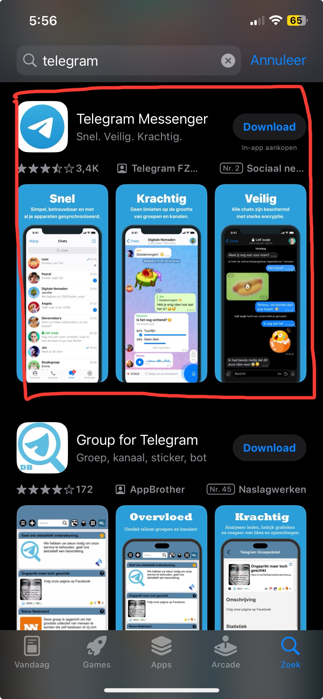

Once you have installed the app on your phone, go to the search bar and look up the user "BotFather". 

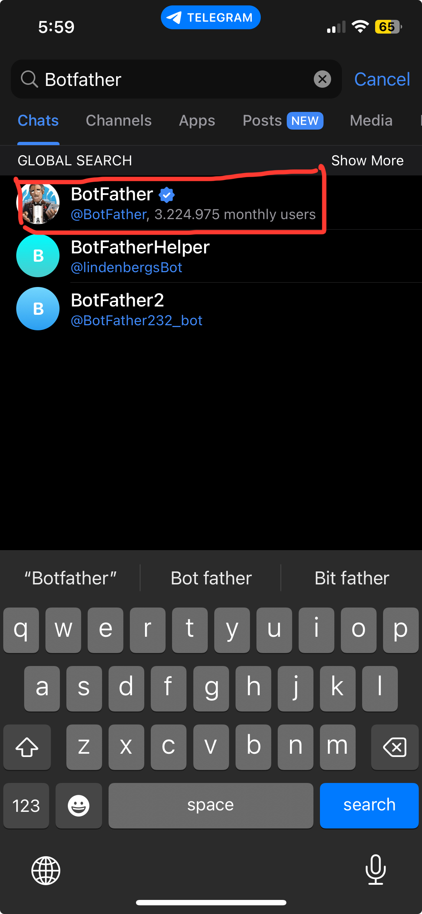

Click on start or type in '/start' to start a chat with BotFather. It will then send a message back talking a little bit about how the bot works.
Type in '/newbot' to create a new bot. Follow the instructions it gives and give the new bot a name. The bot needs a unique name, so don't panic if it doesn't accept the first time.

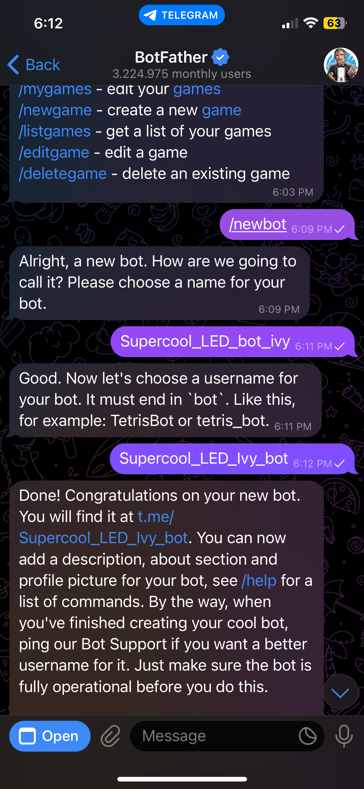

When you have succesfully created a new bot, you will get a confirmation message as response with a link and the bot token. The link will give you acces to the bot. Save this link for later, because you will need it to controle the LED light strip remotely. 

### Step 1.1: Setting up a Telegram User ID
Now anyone who knows your bots name can use it, and we don't want that. This is why we need to create a Telegram User ID. That way your ESP8266 can check if the sender and user ID are the same when your bot recieves a message.

To create a ID navigate to the searchbar and look up "IDBot" or "Myidbot". 


Click on start or type '/start' to start a chat with IDBot. After this type in the command '/getid'. In the response you will get a ID number. Save this number as well, because you will need it for later too.

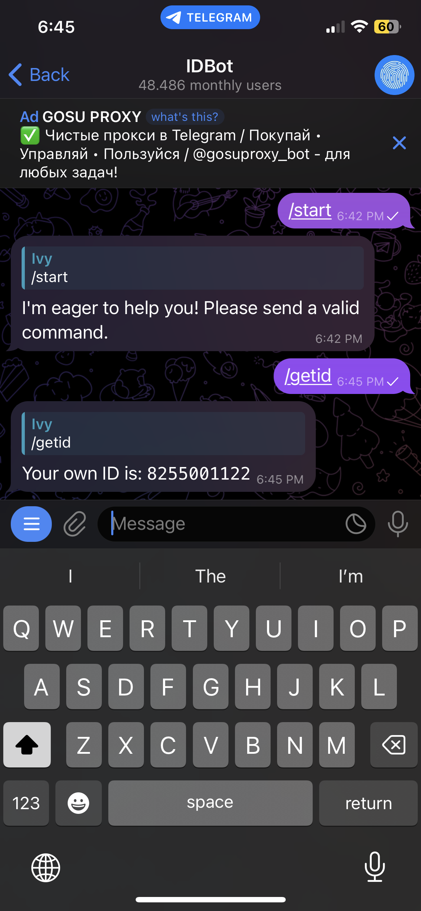

Nice work! You have now finish setting everything up for Telegram. We can now go to the next step.

## Step 2: Setting up Arduino
Now it is finally time for some more technical stuff!

Your LED light strip has three different coloured wires that you need to connect to the correct pin on your ESP8266. The yellow wire needs to be connected to D1 pin, the red one to 3V pin and black one to the G pin. Then insert the ESP8266 into your laptop's USB port.

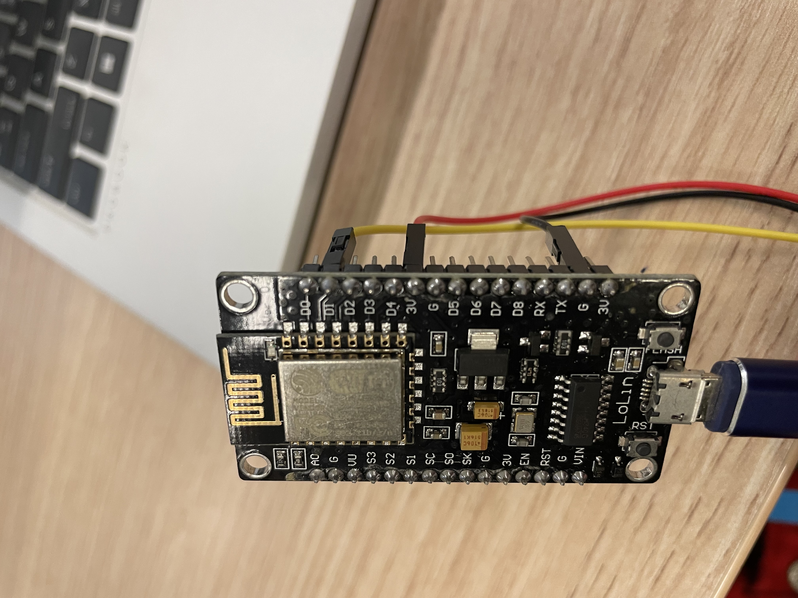

Now you can open Arduino IDE. To start a new sketch go to the top left, click on File and the click on New Sketch.


### Step 2.1: Installing the libraries
Now we need to install a couple of libraries for this project. First we are going to install the Adafruit NeoPixel library. To do this go to the sidebar on the left and click this icon:


If this does not work you can go to the top left and click on Sketch > Include Library > Manage Libraries... . 

Look up Adafruit NeoPixel and click on install. It will be the third option that you see. DON'T install the DMA version, for this can cause errors later on. 

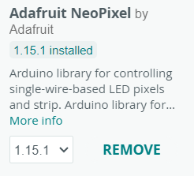

Next, install the Universal Arduino Telegram Bot library. You can stay in the same library manager for this. 

Look up the library, it will be the second option, and click on install.


When you click on install it will give a pop-up message. Click on "install all", we will need the dependencies too. 

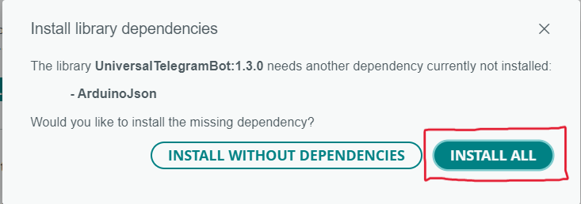

Does this not work for you then downloade the Universal Arduino Telegram Bot library [here](https://github.com/witnessmenow/Universal-Arduino-Telegram-Bot/archive/master.zip) 

Then go to Sketch > Include Library > Add.ZIP Library, then add it. 

Now we will install the last library. Look up the ArduinoJson library in the library manager, it will be the first option, and install this as well.

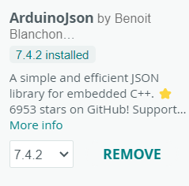

You have now installed all the needed libraries!

## Step 2.2: Board & Port
Make sure that you have the correct board and port selected.

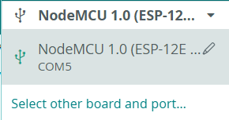

If Arduino does not recognize your board, that is an easy fix.

Go to tools > board > ESP8266 > NodeMCU 1.0 (ESP-12E Module). In the last dorpdown menu you will have to scroll down to find it. 

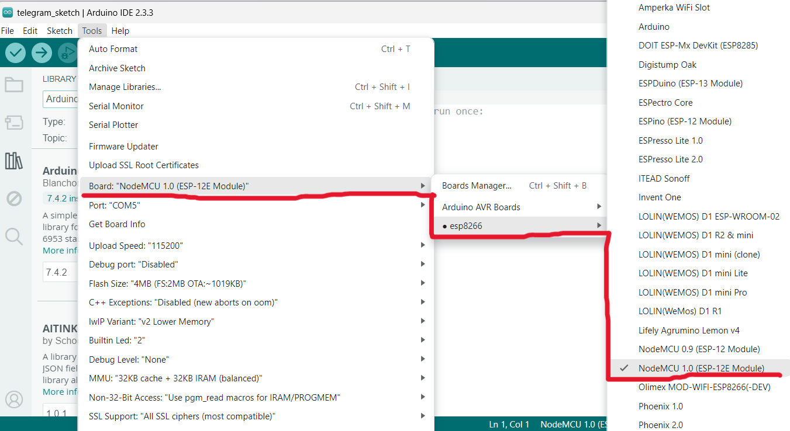

Under tools you will also be able to change the port. If you use Windows you will need a type of COM port for it to work. 

Nicely done! We can now go to the next step!

## Step 3: The code
You can find the needed code [here](https://randomnerdtutorials.com/telegram-control-esp32-esp8266-nodemcu-outputs/). 

But you can also copy it here, remove the default code and paste the code above in its place:
```cpp
#ifdef ESP32
  #include <WiFi.h>
#else
  #include <ESP8266WiFi.h>
#endif
#include <WiFiClientSecure.h>
#include <UniversalTelegramBot.h>
#include <ArduinoJson.h>
#include <Adafruit_NeoPixel.h>
#ifdef __AVR__
 #include <avr/power.h>
#endif

// Replace with your network credentials
const char* ssid = "Your wifi username";
const char* password = "Your wifi password";

// Initialize Telegram BOT
#define BOTtoken "The bot token that you received from BotFather"
#define CHAT_ID "The chat token that you received from MyIDBot"

#define PIN D1
#define NUMPIXELS 12

Adafruit_NeoPixel pixels(NUMPIXELS, PIN, NEO_GRB + NEO_KHZ800);
#define DELAYVAL 500

#ifdef ESP8266
  X509List cert(TELEGRAM_CERTIFICATE_ROOT);
#endif

WiFiClientSecure client;
UniversalTelegramBot bot(BOTtoken, client);

int botRequestDelay = 1000;
unsigned long lastTimeBotRan;

const int ledPin = 2;
bool ledState = HIGH;

// Handle what happens when you receive new messages
void handleNewMessages(int numNewMessages) {
  for (int i=0; i<numNewMessages; i++) {
    String chat_id = String(bot.messages[i].chat_id);
    if (chat_id != CHAT_ID){
      bot.sendMessage(chat_id, "Unauthorized user", "");
      continue;
    }
    String text = bot.messages[i].text;
    String from_name = bot.messages[i].from_name;

    if (text == "/start") {
      String welcome = "Welcome, " + from_name + ".\n";
      welcome += "/led_on to turn GPIO ON \n";
      welcome += "/led_off to turn GPIO OFF \n";
      welcome += "/state to request current GPIO state \n";
      bot.sendMessage(chat_id, welcome, "");
    }

    if (text == "/led_on") {
      bot.sendMessage(chat_id, "LED state set to ON", "");
      pixels.clear(); 
      for(int i=0; i<NUMPIXELS; i++) {
        pixels.setPixelColor(i, pixels.Color(0, 150, 0));
        pixels.show();
        delay(DELAYVAL);
        ledState = LOW;
      }
    }
    
    if (text == "/led_off") {
      bot.sendMessage(chat_id, "LED state set to OFF", "");
      pixels.clear(); 
      pixels.show(); 
      ledState = HIGH;
    }
    
    if (text == "/state") {
      if (digitalRead(ledPin)){
        bot.sendMessage(chat_id, "LED is ON", "");
      }
      else{
        bot.sendMessage(chat_id, "LED is OFF", "");
      }
    }
  }
}

void setup() {
  Serial.begin(115200);

  #if defined(__AVR_ATtiny85__) && (F_CPU == 16000000)
  clock_prescale_set(clock_div_1);
  #endif

  pixels.begin();

  #ifdef ESP8266
    configTime(0, 0, "pool.ntp.org");
    client.setTrustAnchors(&cert);
  #endif

  pinMode(ledPin, OUTPUT);
  digitalWrite(ledPin, ledState);
  
  WiFi.mode(WIFI_STA);
  WiFi.begin(ssid, password);
  #ifdef ESP32
    client.setCACert(TELEGRAM_CERTIFICATE_ROOT);
  #endif
  while (WiFi.status() != WL_CONNECTED) {
    delay(1000);
    Serial.println("Connecting to WiFi..");
  }
  Serial.println(WiFi.localIP());
}

void loop() {
  if (millis() > lastTimeBotRan + botRequestDelay)  {
    int numNewMessages = bot.getUpdates(bot.last_message_received + 1);

    while(numNewMessages) {
      handleNewMessages(numNewMessages);
      numNewMessages = bot.getUpdates(bot.last_message_received + 1);
    }
    lastTimeBotRan = millis();
  }
}
```

## Step 3.1: Changing some code
There are some important parts in the code to focus on. You will need to add your wifi username, wifi password, bot token (that you got from BotFather) and chat token (that you got from MyIDBot). 

```cpp
// Replace with your network credentials
const char* ssid = "Your wifi username";
const char* password = "Your wifi password";

// Initialize Telegram BOT
#define BOTtoken "The bot token that you recieved from BotFather"  // your Bot Token (Get from Botfather)

// Use @myidbot to find out the chat ID of an individual or a group
// Also note that you need to click "start" on a bot before it can
// message you
#define CHAT_ID "The chat token from MyIDBot"
```
Once you have made these small changes in the code, you can upload it. You can do this by clicking on the top left arrow button.


Nice job, you have now added all the code you need!

## Step 4: Using your created bot
We have arrived at the final step to compleet this project!

Go back to Telegram. There, in the chat with BotFather you can find the link to your own bot, the one you created in step 1. You can find the link at the top of the same message that gave you your bot token.

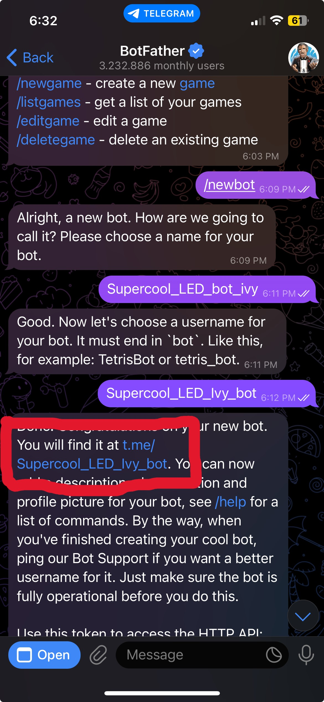

Once you have done that, you can press start or type '/start' to get the bot started. 

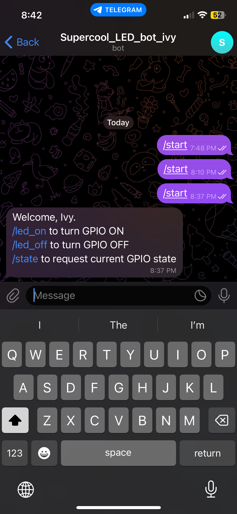

You can then give the commands '/led_on' or '/led_off' to turn the LED light strip on or off.

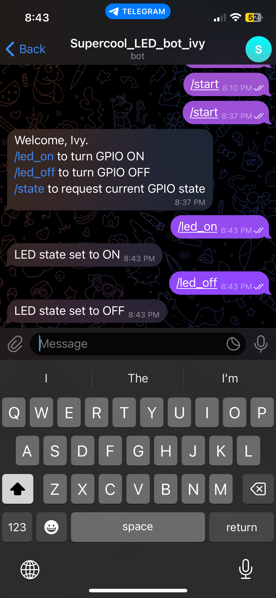

The result will look something like [this](https://youtube.com/shorts/GQqtGxcyNuk)! 

Hopefully this step by step guide was clear and easy to use, and you can now toggle the LED light strip on and off remotely through Telegram!

## Error messages:
While doing this project you might end up with some errors. Here are a couple and how to fix them!

### 1
When you upload your code you can get this error message:
- Compilation error: 'Adafruit_NeoPixel' does not name a type

This error message applies to this part of the code:
```cpp
#define PIN D1
#define NUMPIXELS 12

Adafruit_NeoPixel pixels(NUMPIXELS, PIN, NEO_GRB + NEO_KHZ800);
#define DELAYVAL 500
```
This part of codes calls to the Adafruit NeoPixel library. But if you don't include the library in your code you will get the error message above. 

To fix this you need to go to Sketch > Include Library > Adafruit NeoPixel, you will have to scroll down to find it. 

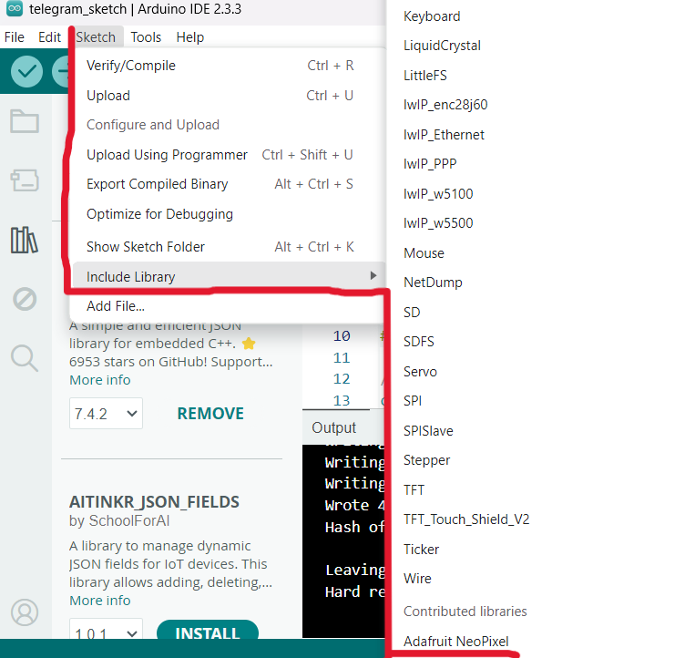

Doing so will add this bit of code at the top
```cpp
#include <Adafruit_NeoPixel.h>
```
If you want you can remove it from the top and add it to where the other code for the libraries is located.

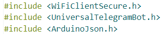

## Source references:
- https://bony-wok-82e.notion.site/IoT-manual-TODO-6-0e90a5164627447ea9a6ee254cb7485e
- https://randomnerdtutorials.com/telegram-control-esp32-esp8266-nodemcu-outputs/ 

Used to fix the error:
- https://forum.arduino.cc/t/problem-with-adafruit_neopixel-library/216562/5 


