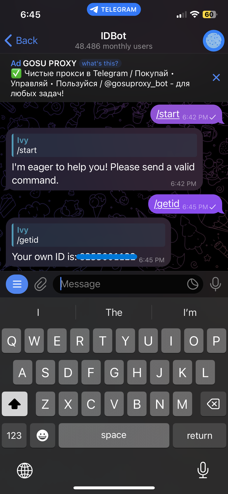

# Telegram and NodeMCU for IoT
By Ivy Schuurman

## Introduction
In this manual I will explain step by step how you can connect your NodeMCU to Telegram, so that you will be able to controle the LED light strip with your NodeMCU.

## What will you need for this project
For this project you will need a couple of diffrent materials to be able to make the project come to life:
1. An ESP8266 board
2. An LED light strip
3. [Arduino IDE](https://www.arduino.cc/en/software/) 

## Step 1: Installing & setting up a Telegram bot
First, before we start to write any line of code, you will have to download the Telegram app on your phone. You can find the app in the App Store & Google Play store.

Once you have installed the app on your phone, go to the search bar and look up the user "BotFather". 

Click on start or type in /start to start a chat with BotFather. It will then send a message back talking a little bit about how the bot works.
Type in /newbot to create a new bot. Follow the instructions it gives and give the new bot a name. The bot needs a unique name, so don't panic if it doesn't accept the first time.

When you have succesfully created a new bot, you will get a confirmation message as response with a link. The link will give you acces to the bot and the bot token. Copy this link for later, because you will need it to create a connection with your ESP8266. 

### Step 1.1: Setting up a Telegram User ID
Now anyone who knows your bots name can use it, and we don't want that. This is why we need to create a Telegram User ID. That way your ESP8266 can check if the sender and user ID are the same when your bot recieves a message.

To create a ID navigate to the searchbar and look up "IDBot" or "Myidbot". 

Click on start or type /start to start a chat with IDBot. After this type in the command /getid. In the response you will get a ID number. Save this number as well, because you will need it for later.

Nice work! You have now finish setting everything up for Telegram. We can now go to the next step.

## Step 2:

## Step 3:

## Step 4:

## Source reference
- https://bony-wok-82e.notion.site/IoT-manual-TODO-6-0e90a5164627447ea9a6ee254cb7485e
- https://icthva.sharepoint.com/:w:/s/FDMCI_ORG__CMD-Amsterdam/Eb7Jd27yWphMuVFbMHV_9WoBEg5_zqAQilsb6Q3gPSKueg?e=f5PM7l 

